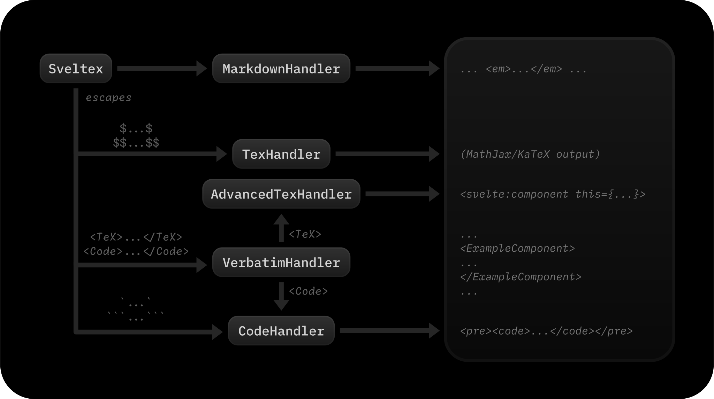

# Sveltex = Svelte + $\mathrm{\TeX}$

[](https://jsr.io/@nvl/sveltex)
[](https://npmjs.com/@nvl/sveltex)
[](https://github.com/nvlang/sveltex)
[]()

## Installation

```sh
<npm|pnpm|yarn|bun> add -D @nvl/sveltex
```

## Documentation

### Quickstart

```js
// svelte.config.js
import { sveltex } from '@nvl/sveltex';
```

## How it works



## Roadmap

In alphabetical order:

-   Add contribution guidelines.
-   Improve CI pipeline.
-   Improve documentation.
-   Improve integration tests.
-   Improve source map support.
-   Support preprocessing LaTeX content before passing it to MathJax/KaTeX.
-   VSCode extension for proper syntax highlighting of `.sveltex` files.
-   Yeoman generator for scaffolding new Sveltex projects.

## Contributing

Contributions are very welcome. In lieu of proper contribution guidelines,
please discuss your ideas with the maintainers before starting work on a PR,
especially if the changes are substantial.
