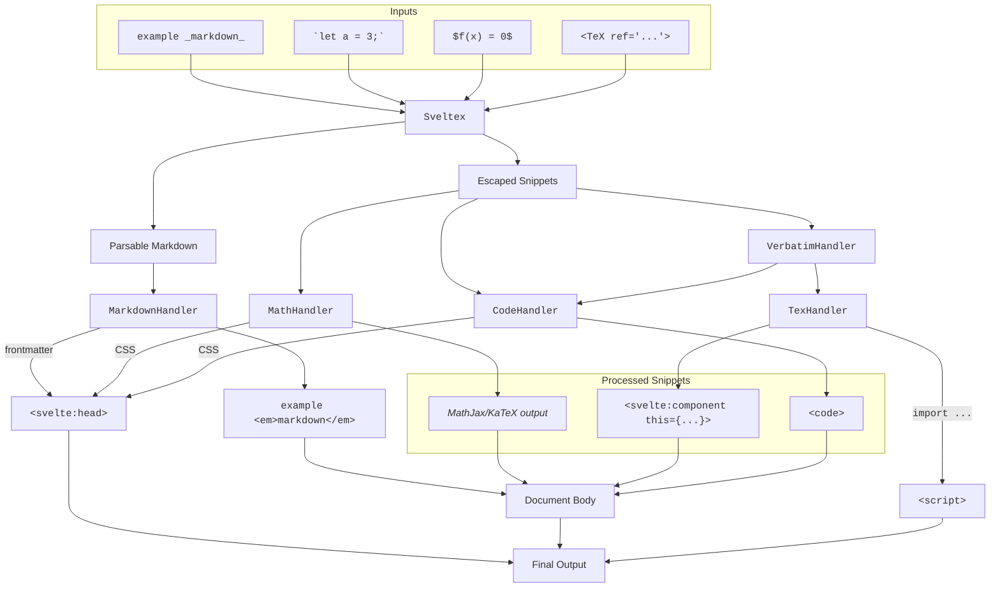

<!--
Directory description: Handlers to which Sveltex delegates the rendering of the
different kinds of content it encounters.
-->

<figure>

<figcaption style="text-align: center; font-style: italic;">
Schematic overview of how SvelTeX works and makes use of its "handlers".
</figcaption>
</figure>

# Handlers

The `src/handlers` directory contains the class definitions for the different
"handlers" to which Sveltex delegates the processing of the different types of
content in a `.sveltex` file. It also includes the class definition of the
`Handler` base class which all handlers extend.

## Overview

### `Handler`

Base class which all other handlers extend.

### `CodeHandler`

Handles code blocks and code spans. This may involve:

-   Syntax highlighting
-   Escaping of special characters

### `MarkdownHandler`

Handles markdown content. It uses external dependencies (as specified by the
user), e.g. [unified](https://unifiedjs.com), to parse markdown content and
convert it to HTML.

### `MathHandler`

Handles math expressions. It uses KaTeX or MathJax to convert math expressions
to CHTML/SVG/etc.

### `TexHandler`

Handles TeX content. It uses the user's local TeX installation to convert TeX
content to SVG.

### `VerbatimHandler`

This class acts as an intermediary between `Sveltex` and the `CodeHandler` and
`TexHandler` classes.

When Sveltex encounters fenced code blocks, it knows that it should delegate the
processing of the content to the `CodeHandler`. When it encounters content
enclosed in `$` delimiters, it knows that it should delegate the processing of
the content to the `MathHandler`. This is because these assignments rest on
well-established conventions and syntax.

However, Sveltex also supports "verbatim" environments. (We call them that
because usually the inner content will be escaped to allow some special
characters, like `{`, `}`, `<`, `>`, etc., to be used at will.) These
environments are delimited in the same way that a Svelte component or HTML tag
would be, i.e., `<Example>...</Example>`, and target two main use-cases:

-   **TeX content**: content that should be processed by the user's local TeX
    distribution to generate an SVG to then include in the final output as a
    Svelte component. This functionality is accessed and configured through the
    `tex` property of the Sveltex configuration.
-   **Code**: content that should be rendered into a code block or code span in
    the final output, but which may benefit from the added customazibility that
    markdown's intentionally minimalistic syntax lacks. This may be useful if
    you'd like to be able to use custom components to render code blocks, or to
    pass a multitude of arguments to configure code blocks ad hoc, etc. This
    functionality is accessed and configured through the `verbatim` property of
    the Sveltex configuration.

To detect these environments, Sveltex checks what tag names were configured for
TeX content and which were configured for code, and matches and escapes all
content it finds within such tags. It then forwards all this to the
`VerbatimHandler` class, which then decides whether to forward the content to
the `TexHandler` or the `CodeHandler`.

## `src/handlers`

| Location | Description |
|:---|:---|
| [`CodeHandler.ts`](CodeHandler.ts) | Handles code blocks and code spans. |
| [`Handler.ts`](Handler.ts) | Base class which all other handlers extend. |
| [`MarkdownHandler.ts`](MarkdownHandler.ts) | Handles markdown content. |
| [`MathHandler.ts`](MathHandler.ts) | Handles math expressions. |
| [`TexHandler.ts`](TexHandler.ts) | Handles TeX content. |
| [`VerbatimHandler.ts`](VerbatimHandler.ts) | This class acts as an intermediary between `Sveltex` and the `CodeHandler` and `TexHandler` classes. |
